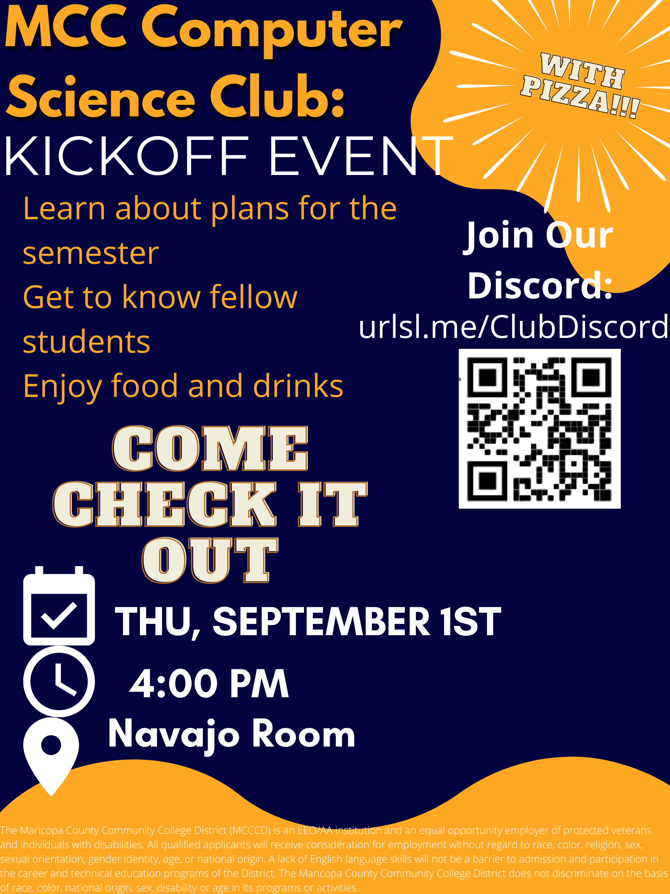

## Upcoming meeting September 1, 2022 @ 4pm MST.

## Join the discord
[urlsl.me/ClubDiscord](https://urlsl.me/ClubDiscord)

## Meeting Schedule

[View the calendar](https://urlsl.me/ghfka). You must be signed into your MCC email.

In general:
Every other week there is an in person meeting at 4pm. 
On the off-weeks there is a more informal online meeting at 4pm.

Sept 1 - Kickoff event
Sept 9 - Leetcode (Friday meeting)
Sept 15 - Git meeting
Sept 29 - UNIX commands
Oct 7 - Git command line (Friday meeting)
Oct 13 - Tool assisted debugging
Oct 27 - Field trip
Nov 10 - Guest speaker
Dec 8 - Chill meeting

Possible second guest speaker

## [Read some past meetings' notes](/notes)
(Sometimes I forget to add them.)

## [Club Constitution](https://docs.google.com/document/d/1lZO2jBUXkcTIfpte7BVjmC_MuQbltA7kBvud9YrpWcM/edit?usp=sharing)
Sign into your MCC email.