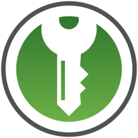

## Why does it matter?
### From [privacyguides.org](https://privacyguides.org):
#### “I have nothing to hide. Why should I care about my privacy?”

 Much like the right to interracial marriage, woman's suffrage, freedom of speech, and many others, we didn't always have the right to privacy. In several dictatorships, many still don't. Generations before ours fought for our right to privacy. Privacy is a human right inherent to all of us that we are entitled to without discrimination.

 You shouldn't confuse privacy with secrecy. We know what happens in the bathroom, but you still close the door. That's because you want privacy, not secrecy. **Everyone** has something to hide, privacy is something that makes you human.

### Some food for thought:
> You might not have anything to hide, but you have everything to protect.

-Mikko Hyppönen

> Arguing that you don't care about the right to privacy because you have nothing to hide is no different than saying you don't care about free speech because you have nothing to say.

-Edward Snowden

### What do you have to protect?
Location data, medical records, credit card, pictures, notes, emails.....

stalking could be a personal concern, government surviellence like ECHELON, FinCEN, [NSA Utah Data Center](https://en.wikipedia.org/wiki/Utah_Data_Center), companies can sell anything you give to them...

## What is security and privacy?
Security is about keeping unauthorized entities out (of your information), privacy is about who those people are.

## What is a threat model?
A threat model identifies threats and defines countermeasures.

A threat model is:
- personal
- not a black and white "you are secure vs not secure"
- slow progress

Everyone already does threat modeling, they just don't know there is a name for it or they're not aware that they're doing it.

Threat modeling is not just for your digital assets, take this automotive threat model for example:

<figcaption><a href="https://www.nccgroup.com/globalassets/newsroom/uk/blog/images/2016/07/th-cc-11.png">Source</a></figcaption>

### From [ArsTechnica](https://arstechnica.com/information-technology/2017/07/how-i-learned-to-stop-worrying-mostly-and-love-my-threat-model/):
To identify what could happen to the things you value and determine from whom you need to protect them, you want to answer these five questions:

1.  What do you want to protect? (The data, communications, and other things that could cause problems for you if misused.)
2.  Who do you want to protect it from? (The people, organizations, and criminal actors who might seek access to that stuff.)
3.  How likely is it that you will need to protect it? (Your personal level of exposure to those threats.)
4.  How bad are the consequences if you fail?
5.  How much trouble are you willing to go through in order to try to prevent those? (The money, time and convenience you're willing to dispense with to protect those things.)
...
Of course, some activities invite risk in and of themselves based on the kind of information being exposed. In the world of threat modeling, these are often referred to as "**assets**"—the important pieces of information you want to use in an activity but simultaneously want to protect:

-   Credit card data: yours, or (if you sell stuff) a customer's.
-   Banking data: account numbers, routing numbers, e-banking usernames and passwords.
-   Personally identifying information: Social Security number, date of birth, income data, W-2s, passport numbers, drivers' license or national ID numbers.
-   Intellectual property: like that treatment for an Ars action movie I've been working on.
-   Sensitive personal or business information and communications: e-mails and texts that could be used to embarrass, blackmail, or imprison you.
-   Politically sensitive information or activities that could get you in trouble with your employer, the government, law enforcement, or other interested parties.
-   Travel plans that could be used to target you or others for fraud or other forms of attack.
-   Other business or personal data that are financially or emotionally essential (family digital photos, for example).
-   Your identity itself, if you are trying to stay anonymous online for your protection.

### A basic threat model
Here's a simple table to help you. Give each cell a value from 1-3 for importance, and a brief (5-10 words) description of your stance/concerns.

|           | People | Companies | Governments |
|-----------|--------|-----------|-------------|
| Security  |        |           |             |
| Privacy   |        |           |             |
| Anonymity |        |           |             |

Example:

|           | People                                         | Companies                                                 | Governments                                            |
|-----------|------------------------------------------------|-----------------------------------------------------------|--------------------------------------------------------|
| Security  | irl security is important for my family safety | I require strong security from companies                  | I generally trust my information to stay safe          |
|           | 3                                              | 3                                                         | 1                                                      |
| Privacy   | I have a small and trusted community           | Privacy is a must when it comes to privacy from companies | I don't see much gain in remaining private from my gov |
|           | 1                                              | 3                                                         | 1                                                      |
| Anonimity | I have little fear when it comes to anonymity  | Anonymity from companies is important when I can          | This is not something I value                          |
|           | 1                                              | 2                                                         | 1                                                      |

[Source](https://youtu.be/DHZRhboZhfI?t=368)

This is very personal and can change over time. For example, a journalist in the US might be very concerned about foreign governments targeting them (for example Pegasus) so they might give their "Security" score in that column a 3. Maybe the journalist retires and after a few years out of the public eye downgrades that concern to a 2.

> Just be realistic
> you should do fine

## Basic privacy security tools and practices you should be using
- [privacytools.io](https://privacytools.io)
- [privacyguides.org](https://privacyguides.org/)
- [techlore vpn chart](https://techlore.tech/vpnchart)

"Good security is something you know, have or are." - some RFC somewhere that I can't find the reference to

### Some basics *everyone* should do:
-   Back up your stuff to the cloud or a disk drive you detach from your device.
-   Use a password manager to automate your use of separate passwords for every website.
-   Update your software whenever alerted to do so; turn on automatic updates.

<figcaption><a href="https://keepassxc.org">KeePassXC</a>, my favorite password manager</figcaption>

### Some more advanced things:
- Using Multi-Factor Authentication wherever possible
- Looking through the privacy settings of the apps and services you use
- [Browser hardening](https://github.com/arkenfox/user.js/wiki/1.1-to-arkenfox-or-not) (firefox recommended)
- Self-hosting your own services.

<figcaption>A yubikey, a hardware security key that can aid in MFA. This can be the "something you have" part of "good security."</figcaption>
